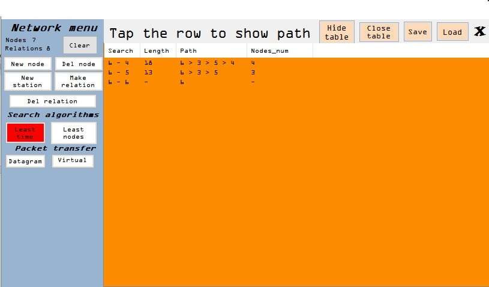

<h1>Routing in the data network</h1>

## Table of contents
* [General info](#general-info)
* [Tools and Technologies Used](#Tools and Technologies Used)
* [Use](#Use)
* [Features and Requirments](#Features and Requirments)
* [Setup](#Setup)
* [General overview](#General overview)
* [Project Structure](#Project Structure)
* [Interface Description](#Interface Description)
* [Program guide](#Program guide)

## General info

This is a C# Desktop Application for modeling the functioning of a computer network and studying the characteristics of the transmission of messages of different sizes with the determination of the size of information and service traffic, the number of transmitted packets, and the optimal size of information packets for specified transmission conditions.
	
## Tools and Technologies Used

* C# Programming language: ISO/IEC 9899:2011
* Microsoft Visual Studio (2019)
* .NET Framework 4.7.2
* Windows 11 or Windows 10 v1903 (18362) or newer.

 ## Use
 
 - development of a virtual data network for testing and research of real computer networks
 - educational product for meeting with the concepts of network relations

## Features and Requirments

- quick manual input of components of the network topology with the mouse - nodes and channels (full duplex and half duplex);
- random generation of network structure with specified creation policies;
- policies for channels: random weight selection within specified limits and constant value from a given set of values;
- policies for channel buffers: random weight selection within specified limits and constant value from a given set of values;
- implementation of basic user controls: adding, deleting, selecting, dragging nodes and channels;
- when capturing an object with the mouse, basic information about the object is displayed (for example, routing table, channel weight, loading buffers, etc.);
- the ability to disable, enable selected nodes and channels;
- review of step-by-step execution of algorithms;
- generating random message traffic;
- menu for sending specific messages from one network workstation to another, indicating their size.

## Setup

1. Download and Clone this project
2. Open the solution file in visual studio
2. You are Ready to Go

## General overview

Combining networks consisting of different subnets is achieved through routers, which in turn perform the following functions:

- providing communication between networks;
- providing routing and data delivery, which exchange processes on end systems connected to different types of networks;
- presentation of these functions in such a way that it is not necessary to change the architecture of any of the connected subnets.

The main components of the network are routers connected by communication lines, as well as devices belonging to the client.

There are three ways to transmit data packets, namely: simplex, half-duplex and full-duplex. The transmission mode determines the direction of signal flow between the two connected devices.
The main difference between the three modes of transmission is that in the simplex mode of transmission, the connection is unidirectional or unilateral; whereas in half-duplex transmission mode, the connection is bidirectional, but the channel is used interchangeably by both connected devices. On the other hand, in full-duplex transmission, the connection is two-way or two-way, and the channel is used by both connected devices at the same time.

An important function of the network layer is to select the route for transmitting packets from the start to the end node. In most networks, packets need to go through multiple routers. Route selection algorithms and the data structure they use (algorithms) are the main goal when designing a network layer.
The routing algorithm is implemented by the part of the network layer software that is responsible for selecting the source line to send the incoming packet. You also need to understand that routing and forwarding are different processes. Forwarding is the processing of incoming packets and choosing for them, according to the routing table, the source line. Routing is responsible for filling in and updating routing tables. This uses routing algorithms.

<h3>Distributed adaptive routing algorithm</h3>

In this algorithm, the connected nodes exchange information for further distribution. As a result, a recalculation of the routing table each time the node receives information.
Additionally, one network can have several optimum routes. The set of optimal paths from all senders to recipients is called the input tree. The task of all route selection algorithms is to calculate and use the input tree for all routers. The input tree does not contain loops, so each packet is delivered to the recipient for a limited number of forwardings. However, in real life, communication lines and routers may fail during certain operations. Therefore, different routers may have various ideas about the current network topology.

There are several algorithms for finding the shortest path between two nodes. One of them was proposed by Edsger Wybe Dijkstra in 1959. Each node "notices" the distance to it from the sender's node in the least known way. Initially, the paths are unknown, so all nodes are considered inaccessible. After finding distances, the node marks change and indicates the optimal path. Once the way is clear, the mark corresponds to the shortest path, transforming into a permanent relation.

<h3>Expected output</h3>

- transmission time from the initial node to the final;
- the number of packets into which the message was broken;
- the amount of official information;
- transmission route.

## Project Structure

The program code is divided into functional-program parts and placed in appropriate files that emulate the work of the MVC template (model-look-controller), which divides the program into three logical and interconnected blocks, which allows you to organize the structure for more intuitive text design and simplification further modification of the program. Classes are the internal object base.

The conceptual model of a software product depicts the file structure of a program through the relationships between its modules. Thus, the input file that starts the program is the module Program.cs, which refers to the file application_view.cs, which in turn contains elements of modules such as algorithm_model.cs and graphick_control.cs, each of which includes the module data_object .cs. These software blocks are designed to perform the following functions:

* Program.cs - launches the main program, enables visual styles, connects to .NET frameworks and supports older versions, and launches the standard form.
* Application_view.cs - implements the graphical interface of the program and provides an image of the main working background of the software product to the user, which allows you to manipulate the graphical elements of the program and perform all the defined functionality.
* Graphick_controller.cs - is responsible for creating graphical elements of the program and is constantly tracking all possible actions that would change the displayed information and in turn display the current state of the program.
* Algorithm_model.cs - is responsible for the logical interpretation of data, performing the function of calculating the shortest paths of the graph according to the Dijkstra algorithm, finding the weight between nodes, conducting a packet path with timely splitting and message collection using datagram or virtual channel method.
* Data_objects.cs - is a repository of all newly created data structures, which are grouped into appropriate structures and are responsible for determining the basic building blocks of the program in the form of routers, workstations and connections between them.

# Interface Description

The graphical interface is a set of three windows: a network menu consisting of toolbars for manipulating the object part of the program, a work area for displaying the corresponding dynamic elements and a main panel containing buttons with functions to save and load created networks and display relevant control information.

1. Network menu - this area consists of three submodules: "New York menu" - "Network menu", "Search algorithms" - "Search algorithms", "Packet transfer" - "Packet transfer". The network menu includes counters of nodes and connections, which are located immediately under the name "Nodes" and "Relations", respectively. The "Clear" button is responsible for completely clearing the work area of ​​objects. The “New node” button creates a new node in the work area after clicking the left mouse button, the “New station” button creates a new station, the “Del node” button deletes the corresponding node or station after selecting it, the “Make relation” button creates a connection between nodes or stations after the selection of these objects. The "Del relation" button allows you to delete the created relationship between the objects on the canvas after successively clicking on the corresponding elements.
2. Main panel - the area contains four or three functional elements. The "Save" button opens a panel that allows you to specify the path to save the file and its name. The “Load” button opens a panel that allows you to select the appropriate file and upload the appropriate network structure to the work area. The "X" button allows you to end the program. There is an empty zone from the cluster of buttons designed to display instructions and additional information after clicking the appropriate buttons in the network menu.
3. Workspace - allows you to create graphic objects with the mouse and control their location and status according to the actions taken by the user.

## Program guide

Consider the procedure that must be performed to create a network in this software product.

To create the desired network structure, which contains 4 nodes and 3 stations, you must first click "New node", which will change the background of this element to red, which means that at the moment in the work area will be active function of adding new nodes , which is a property of each button, except for the "Clear" element, which immediately fulfills its purpose. To disable this feature, either switch to another mode and activate another state, or press the same object again. When you click on the free areas of the work area 4 times, clickable nodes will appear on the screen.

Then go to the mode of adding stations by clicking on the button "New station" and add 3 stations, performing a similar sequence of operations. The last pressed item is painted green. The node is indicated by a gray circle with the element number inside, the station is an object connected by two rectangles of different shades of gray with the sequence number shown in the figure below.

The next step is to add connections between stations and nodes. Click on the "Make relations" button and pay attention to the panel that opens at the bottom of the network menu. The drop-down list located in the upper left corner of the panel contains the values ​​of the weights of the elements that will be given to the created links. The "Random" checkbox indicates the function of assigning random weights to relationships among the specified values. The “Duplex” and “Half-duplex” radio buttons indicate the type of connection, assigning a duplex or half-duplex type, respectively. The duplex type is indicated by a straight fixed line, and the half-duplex type is represented by a dashed line of dark blue color. The "auto" check box indicates the mode for automatically linking items. When the flag is positive, you can connect free items continuously until there are no free items left. Otherwise, after adjusting the connection parameters, you should press the "Approve" button, which will allow you to connect the two elements. At the same time, the panel itself will disappear and the mode will go into standby mode, changing the color of the “Make relation” button to yellow. Reactivating this feature will require you to press this button again. As a result, we obtain the following graph.

In order to find the shortest paths according to the distributed routing algorithm, you need to select the path mode with the shortest length by clicking on the "Least time" button and the path mode that takes the least number of transit nodes. Then you need to click on a specific station, because if you select a network node in the main panel will display the corresponding error. The work area will display a table (Fig. 7), which will contain information about each path, as the sending and receiving station in the column "Search", the length of the path in the column "Length", the path in the column "Path" and the number of elements involved in column "Nodes_num". There are also two "Hide table" and "Close table" buttons in the title menu. The first is responsible for collapsing the table, after clicking which its text changes to "Show table" with the acquisition of the function of expanding this list. The “Close table” button completely closes the table.

Selecting the corresponding line by left-clicking will highlight the corresponding path by coloring the elements in blue and light orange links.

Activating the packet transmission mode allows you to send messages in two ways: datagram and virtual channel creation. The first method becomes available after pressing the "Datagram" button, the second method after pressing the "Virtual" button.

